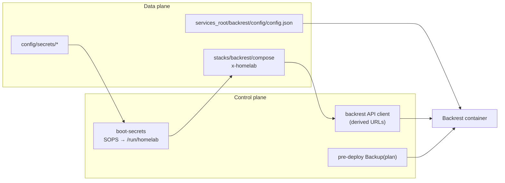

# DEP-003 — Backrest integration (control plane)

**Status:** phase A/B implemented (derived client, template stack, Saturn `integrations.backrest`). Legacy `config/backrest.yml` optional fallback until phase D.

## Goal

An operator adds a **Backrest stack** to their data repo (compose + `x-homelab` + SOPS secrets). **homelab-control** discovers how to reach the Backrest HTTP API and where `config.json` lives — **without** site-specific files such as `config/backrest.yml`, `config/restic.yml`, or bespoke `render-backrest-config.py` scripts.

Backrest **`config.json` on the services volume is the SSOT** for backup plans, paths, and schedules. The UI (or a one-time import) authors that file. **Git + control** wire networking, secrets, deploy hooks, and optional API calls.

Related: [DEP-002-boot-secrets.md](./DEP-002-boot-secrets.md), [control-data-plane.md](./control-data-plane.md).

## Reusability (non-negotiable)

1. **Control MUST NOT** require a private data-repo Python module or custom YAML dialect to deploy Backrest.
2. **Adopters MUST NOT** copy another operator’s `/tank/...` paths or host labels from example config files.
3. **Policy** (what to back up, when) lives in **Backrest** (`config.json`), backed up with the stack’s config volume — not compiled from a second git SSOT on every boot.

Legacy homelab-config paths (`config/restic.yml`, `config/backrest.yml`, render/apply scripts) are **Saturn migration debt**, not part of the shareable contract.

## Runtime model



| Artifact | Owner | Notes |
|----------|--------|--------|
| `config.json` | Backrest / operator | Plans, repos, paths, crons; **include `…/backrest/config` in a backup plan** (via UI once stack exists). |
| `rclone.conf`, restic password | SOPS in data repo | Decrypt to `/run/homelab`; compose bind-mount per stack metadata. |
| Repo **`guid`** | Backrest (one-time UI) | Not git policy; persisted inside `config.json`. See [Guid](#guid). |
| API base URL | **Derived** by control | From `config/homelab.yml`, `config/homelab-container.yml`, placement, publish port — not hand-edited `backrest.yml`. |

## x-homelab contract (v1 extension)

Add optional **`integrations.backrest`** on stacks that run the Backrest app (schema bump documented in data-plane `x-homelab-stack-schema.md` when implemented).

```yaml
x-homelab:
  version: 1
  placement: saturn
  publish:
    - service: backrest
      port: 9898
      dns:
        hostnames: [backrest.example.com]
  config:
    secrets:
      - config/secrets/rclone.conf
      - config/secrets/restic-password
  integrations:
    backrest:
      # Logical ids inside config.json (operator creates in UI or template JSON once).
      repo_id: gdrive-homelab
      plans:
        predeploy: homelab-predeploy
        manual: homelab-manual
      # Optional; default from service env BACKREST_CONFIG + services_root layout.
      config:
        service: backrest
        env: BACKREST_CONFIG   # path inside container, e.g. /config/config.json
```

### Compose requirements (data template)

- **`paths.services_root`** from `config/homelab.yml` — no hardcoded host paths in shareable compose.
- Volumes: `{services_root}/backrest/config`, `data`, `cache`, `tmp` (layout convention: `{services_root}/<stack>/…`).
- Env: `BACKREST_CONFIG=/config/config.json`, `RCLONE_CONFIG` → bind `/run/homelab/rclone.conf` (after boot-secrets).
- **`config.render` MUST NOT** list site-specific Backrest compiler scripts for template stacks.

### Control derivation rules

Given stack key `backrest` and metadata above, control **MUST** be able to compute:

| Need | Derivation |
|------|------------|
| Host API URL (scheduler container) | `homelab-container` / publish `port` / placement host from `config/hosts.yml` or container networking doc |
| Host API URL (host CLI) | `127.0.0.1:{port}` or documented fallback list |
| Host path to `config.json` | Map container `BACKREST_CONFIG` + compose volume bind under `services_root` |
| Pre-deploy plan id | `integrations.backrest.plans.predeploy` |
| Manual plan id | `integrations.backrest.plans.manual` |

Implementation lives in **homelab-control** (`homelab_paths.py` + small `backrest_integration.py` or extended client), reading **only** data checkout YAML/compose — never `homelab_stack_registry` imports at runtime on adopters’ machines (registry may run in **CI** to validate compose).

## Control features

### DEP-003-1 — Generic API client

- Replace reads of `config/backrest.yml` with derived config (keep same RPCs: `GetConfig`, `SetConfig`, `Backup`, `ListSnapshots`).
- Timeouts and plan ids from `integrations.backrest` with documented defaults for the data template.

### DEP-003-2 — Pre-deploy backup hook

- When `config/deploy.yml` (or poller) schedules a deploy, if **`integrations.backrest`** exists on any stack **or** a single global flag in `config/homelab.yml` points at stack key `backrest`, control **MUST** trigger `Backup(predeploy plan)` before stack playbooks — same behavior as today’s `trigger-backrest-backup.py`, without hardcoding script paths in the data repo.

### DEP-003-3 — Boot secrets only (no policy compile)

- Boot-secrets **MUST** decrypt stack-listed secrets; **MUST NOT** require `render-backrest-config.py` in the default template boot manifest.
- Optional **data-plane** `apply-backrest-config` remains allowed for sites that push JSON to API after edits; not required for adopters who only use UI + disk SSOT.

### DEP-003-4 — SQL / prepare jobs (optional)

- Site-specific **prepare** (SQL dumps before nightly backup) **MAY** stay a **data-plane scheduler script** or future `x-homelab.scheduler` job — **out of scope** for minimal Backrest adoption. Document in template README; do not require `config/restic.yml`.

## Guid

Backrest assigns each restic repo an internal **`guid`** when the repo is first registered (typically UI). It is **not a secret** but **instance state**:

- Control **MUST NOT** invent or commit a guid as policy.
- **`config.json`** (backed up) carries the guid after bootstrap.
- Document **one-time setup**: deploy stack → open UI → add repo matching `repo_id` / URI → save → ensure config directory is in a backup plan.

Optional later: `integrations.backrest.bootstrap.guid_file` under `services_root` for air-gapped restore — **not required** for v1 template.

## Data template deliverables

Under `homelab-data-template/`:

- `stacks/backrest/docker-compose.yml` — generic volumes, `x-homelab` with `integrations.backrest`.
- `config/secrets.example/rclone.conf`, `restic-password` — placeholders only.
- README section: bootstrap guid, author plans in UI, back up `{services_root}/backrest/config`.

**Exclude** from template: `config/restic.yml`, `config/backrest.yml`, `render-backrest-config.py`.

## Saturn cutover (homelab-config)

Phased deprecation of migration-only layers:

| Phase | Action |
|-------|--------|
| A | Land DEP-003 + control client derivation; dual-run tests against derived URLs vs legacy `backrest.yml`. |
| B | Add `integrations.backrest` to `stacks/backrest/docker-compose.yml`; replace `/tank` binds with `services_root` rendering. |
| C | Remove boot/deploy dependency on `render-backrest-config.py` / `apply-backrest-config.py` when JSON SSOT stable; drop `config/restic.yml` policy compile. |
| D | Delete `config/backrest.yml`; fold any remaining URLs into derived config only. |

Until phase C, existing render scripts **MAY** remain on Saturn as data-plane-only debt.

## Requirements index (future)

| ID | Check (when implemented) |
|----|---------------------------|
| DEP-003 | Template backrest stack validates without `config/backrest.yml` |
| DEP-003 | Control derives API URL from fixture compose + homelab.yml |
| CFG-* (site) | homelab-config registry `check` requires `integrations.backrest` when stack key is `backrest` |

## Open questions

- **Global vs per-stack pre-deploy:** one Backrest per site (template assumption) vs multiple — v1 assumes **one** integration block on the backrest stack; poller references stack key from `config/homelab.yml` optional `integrations.backrest_stack: backrest`.
- **SetConfig on deploy:** default **off** for adopters (UI SSOT); opt-in `integrations.backrest.sync_on_deploy: true` for git-managed JSON snippets later (not full `restic.yml`).
