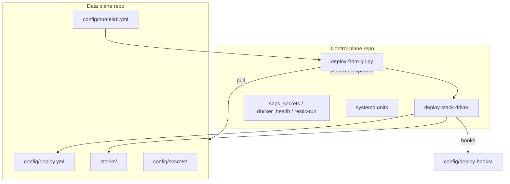

# Control plane vs data plane

Goal: **share the deploy/ops engine** (control plane) separately from **this homelab’s stacks, config, secrets, and paths** (data plane). Today both live in one git repo (homelab-data on the deploy host). This doc defines the split, the contract between sides, and a phased migration.

Related: [deploy-observability.md](./deploy-observability.md), [whydidibuildthis.md](./whydidibuildthis.md).

## Definitions

| Plane | Responsibility | Shareable? |
|-------|----------------|------------|
| **Control plane** | Git-driven deploy poller, stack driver, health wait, SOPS tooling, restic runner, upgrade/ops job runners, systemd units, generic docs/blog patterns, optional SRE *code* | Yes — scrub site-specific names, ship examples |
| **Data plane** | `stacks/*`, `config/*.yml`, `config/secrets/*`, `config/deploy.yml` path map, DNS/OPNsense/Proxmox inventory, restic path lists, host IPs, media mount layout, per-stack render scripts and post-deploy hooks | No — private per site (this repo or a slim `homelab-data` repo) |

**Rule of thumb:** if it mentions your LAN domain, site-specific mount paths, a VMID, or an API token, it is data plane. If it implements “pull git → backup → compose → health → notify,” it is control plane.

### Reusability (non-negotiable)

**homelab-control MUST run for any operator** who supplies their own data checkout (or `homelab-data-template/`) and host paths in `config/homelab.yml`. The control image and scripts MUST NOT:

- import or require modules from a specific private data repo (e.g. site stack registries);
- `exec` data-repo orchestration that duplicates control responsibilities (boot-secrets belongs in control; data supplies `config/boot-secrets.yml` lists only).

Data-plane repos MAY generate those YAML manifests from local conventions (CI sync from `x-homelab`, etc.); that logic stays in the data repo and is not a runtime dependency of control.

See [DEP-002-boot-secrets.md](./DEP-002-boot-secrets.md).

## Current layout (monorepo)

```
homelab-data/          # control + data today
├── scripts/             # mostly control (deploy-from-git.py, deploy-stack.sh, sops, restic)
├── systemd/             # control
├── stacks/              # data (compose + Dockerfiles)
├── config/              # data (deploy.yml is data — your stack list)
├── config/secrets/      # data
├── restic/              # data (paths, schedules)
├── automation/          # data (inventory)
├── stacks/sre/          # hybrid — TypeScript bot is control-ish; wired to config/sre.yml (data)
└── docs/, blog/         # mostly control (shareable narrative)
```

**Tight couplings to unwind**

1. **`deploy-from-git.py`** — single `git -C ROOT`; `.generated/` next to config; invokes scripts under the same tree.
2. **`deploy-stack.sh`** — giant `if [[ "$STACK" == … ]]` for renders, builds, and post-up hooks (site-specific).
3. **Render scripts** — read `config/<stack>.yml` and `config/secrets/` beside them.
4. **`link-stacks.sh`** — hardcoded stack list symlinking into `/var/lib/homelab/services`.
5. **Timers** — `WorkingDirectory` and `ExecStart` point at one clone path.

None of these are fundamental; they assume one checkout root.

## Target architecture

Two git repositories on the deploy host (names illustrative):

| Repo | Role | Typical visibility |
|------|------|-------------------|
| `homelab-control` | Engine + shared libraries + example data template | Public or shared read-only |
| homelab-data (renamed mentally to **data**) | Your stacks, config, secrets (SOPS), deploy map | Private |



### Site manifest (`config/homelab.yml`)

The data plane owns one file that tells the control plane where things are. Template: [`homelab-data-template/config/homelab.example.yml`](../homelab-data-template/config/homelab.example.yml).

Important fields:

- **`paths.data_root`** — git checkout of the data repo (today: same as monorepo root).
- **`paths.control_root`** — checkout of control repo; when unset, control scripts live inside the data repo (monorepo mode).
- **`paths.services_root`** — live compose tree (`/var/lib/homelab/services`).
- **`paths.generated`** — tmp state (`.generated`, pending deploy, failure text).
- **`paths.secrets_runtime`** — `/run/homelab` tmpfs targets.
- **`git.data_remote` / `git.data_branch`** — what the poller fast-forwards for stack changes.
- **`git.control_ref`** — tag or SHA pin when control is a separate repo (avoid surprise engine changes).

Monorepo mode: only `homelab.yml` paths need to match reality; `control_root` omitted.

### Deploy contract (`config/deploy.yml`)

Stays on the **data plane** — which stacks exist and which paths trigger them is site-specific. The control plane only interprets the schema.

Evolution: add optional per-stack keys so data plane owns behavior without editing control scripts:

```yaml
stacks:
  recyclarr:
    paths: [...]
    post_up:
      - compose_exec: ["recyclarr", "recyclarr", "sync"]
    # or: hook: config/deploy-hooks/recyclarr.sh
```

Long term, replace `deploy-stack.sh` conditionals with **declared hooks** or small scripts under `config/deploy-hooks/` in the data repo.

### Secrets

- **SOPS policy** (`config/sops.yml`, age recipients) — data plane (recipient list is site-specific).
- **Encrypt/decrypt tooling** (`scripts/sops_secrets.py`, `render-all-secrets.sh`) — control plane.
- **Plaintext secrets** — never in control repo; only `config/secrets.example/` templates in control or data.

### Generated and state

| Path | Plane | Notes |
|------|-------|-------|
| `.generated/deploy-pending.json` | Data checkout | Tied to deploy SHA of **data** repo |
| `.generated/deploy-last-failure.txt` | Data checkout | |
| `/run/homelab/*.env` | Host runtime | Rendered from data secrets |
| Portainer/Komodo DB | N/A | Not used |

## What to put in a shareable control repo

Include:

- `scripts/deploy-from-git.py`, `deploy-stack.sh` (eventually generic driver)
- `scripts/wait-stack-healthy.py`, `docker_health.py`
- `scripts/sops_secrets.py`, `sops-encrypt.sh`, `age-run.sh`, `render-all-secrets.sh`, `boot-secrets.sh`, `run-boot-secrets-renders.py` (framework)
- `scripts/restic-run.py` (generic); **exclude** site `restic/restic.yml` or ship `restic.example.yml`
- `systemd/*` templates with `EnvironmentFile=` pointing at `homelab.yml` paths
- `docs/`, generic blog posts, `whydidibuildthis.md`, `deploy-observability.md`
- `stacks/sre/` **optional** — if shipped, document required `config/sre.yml` shape in data plane

Exclude:

- `config/dns.yml`, `opnsense.yml`, `proxmox/`, `secrets/`
- All production `stacks/` except perhaps one **example** stack (e.g. glance)

Ship a **`homelab-data-template/`** directory: minimal `deploy.yml`, `homelab.yml`, one stack, secrets examples.

## Migration phases

### Phase 0 — Document and manifest (now)

- This doc + `config/homelab.example.yml`.
- No behavior change; monorepo remains source of truth.

### Phase 1 — Dual-root aware scripts

- Introduce `homelab_paths.py` (or equivalent) loaded from `config/homelab.yml`:
  - `DATA_ROOT`, `CONTROL_ROOT`, `SERVICES_ROOT`, `GENERATED_ROOT`.
- `deploy-from-git.py`: pull **data** repo; optionally verify **control** pin.
- `deploy-stack.sh`: `REPO_ROOT` → `DATA_ROOT`; invoke helpers from `CONTROL_ROOT/scripts`.
- Systemd: `Environment=HOMELAB_CONFIG=...` or drop-in reading `homelab.yml`.

### Phase 2 — Extract git history

- Split with `git subtree` or new repo + copy:
  - Control: engine + docs + examples.
  - Data: everything site-specific.
- deploy host: two clones; pin control version in `homelab.yml`.
- CI: control repo tests generic scripts; data repo runs dry-run or lint on `deploy.yml`.

### Phase 3 — Declarative stack hooks

- Move `deploy-stack.sh` branches into data-plane `config/deploy-hooks/<stack>.sh` or YAML-driven steps.
- Control driver: render → compose pull/build → up → health → run declared hooks (fail-hard by default; see deploy-observability).

### Phase 4 — Publish control plane

- License, README, remove site-specific identifiers from shared tree.
- Optional: publish SRE image from control repo; data repo only supplies config.

## Operating two repos on the deploy host

Example paths:

```text
/opt/homelab/control   # tag v0.3.0
/opt/homelab/data    # branch main (data)
/var/lib/homelab/services              # symlinks → data stacks
```

Poller flow:

1. Fetch/pull **data** `main` (stacks/config changed).
2. If `homelab.yml` `git.control_ref` ≠ checked-out control SHA, fetch control at pin (manual or automated bump PR on data repo).
3. Run `control/scripts/deploy-from-git.py` with `DATA_ROOT` set to data checkout.
4. Dirty-tree and Telegram semantics unchanged; failures still under data `.generated/`.

## Why not put the control plane in Komodo / Doco-CD?

Those tools can **replace the poller UI**, but your **data plane** (SOPS tmpfs, path map, OPNsense, Neptune, restic gate) remains a separate repo either way. Splitting control/data first makes it obvious what you would invoke from an external GitOps tool: **one data checkout + one entry script from control**.

## Next steps (recommended order)

1. Copy `config/homelab.example.yml` → `config/homelab.yml` when you want explicit paths (optional in monorepo).
2. Implement Phase 1 path loader + env overrides in the poller (small PR).
3. List stack hooks to move out of `deploy-stack.sh` (Recyclarr, Cleanuparr, llmster build, etc.) — drives Phase 3 design.
4. When Phase 2 splits repos, update `AGENTS.md` and deploy host clone paths in README.
