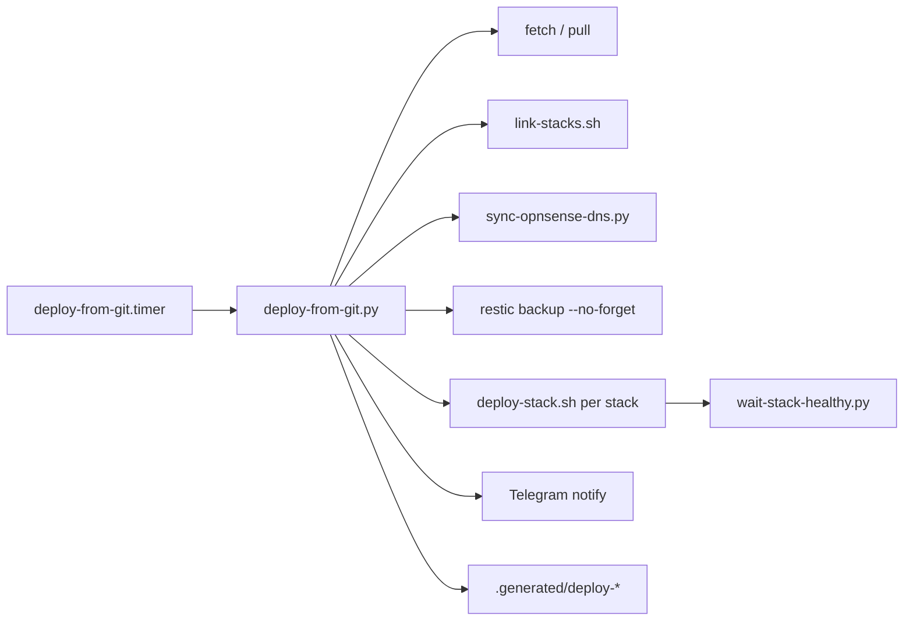

# Deploy failure modes and observability

The deploy pipeline deploys through **bash and Python** on the deploy host. That is not inherently silent: the main path is **fail-hard** with journal output, on-disk failure records, pending retries, and Telegram. This document lists what is guarded, where soft failures can hide, how to diagnose, and how that compares to “mature” GitOps tools.

See also [whydidibuildthis.md](./whydidibuildthis.md) (why custom deploy vs off-the-shelf products).

## Pipeline overview



Configuration: `config/deploy.yml` (path → stack map, health timeouts, `notify`).

## What fails loud (by design)

| Stage | Behavior on failure |
|-------|---------------------|
| **Dirty working tree** on the deploy host | Pull refused; Telegram; message mentions local edits |
| **`git pull --ff-only`** | Exception; non-zero exit; `deploy-last-failure.txt`; Telegram (deduped) |
| **Transient `git fetch`** | Retries in `deploy-from-git.py`; if still failing, Telegram then **exit 0** so the timer is not red every minute (no stack deploy attempted) |
| **`link-stacks.sh`** | `check=True`; aborts deploy batch |
| **`sync-opnsense-dns.py`** (when triggered) | `check=True`; aborts before stack deploys |
| **Pre-deploy restic** | `check=True`; no compose if backup fails |
| **`deploy-stack.sh`** | `set -euo pipefail`; non-zero aborts remaining stacks in this run |
| **`wait-stack-healthy.py`** | Non-zero if required services lack `healthy` within timeout |
| **Mid-list stack failure** | Successful stacks stay deployed; `.generated/deploy-pending.json` holds **remaining** stacks for retry on the next timer tick |
| **systemd** | `deploy-from-git.service` is `Type=oneshot`; failed runs (exit ≠ 0) show as failed in the journal |

### On-disk and chat signals

| Artifact | Purpose |
|----------|---------|
| `.generated/deploy-last-failure.txt` | Last failure text; used to **dedupe** Telegram (`notify_failure_once`) |
| `.generated/deploy-pending.json` | `{ "sha", "stacks" }` — stacks not yet deployed for this commit |
| `.generated/deploy.lock` | flock while poller runs |
| **Telegram** | `notify.on_success` / `notify.on_failure` in `config/deploy.yml` |
| **journal** | `journalctl --user -u deploy-from-git.service` (or system unit if installed that way) |

After a failed deploy, AGENTS.md points here: read journal, `deploy-last-failure.txt`, and `deploy-pending.json`.

## Where failures can hide or look like success

These are the main gaps when worrying about “bash/Python failing silently.”

### Intentional soft success in `deploy-stack.sh`

| Location | Pattern | Effect |
|----------|---------|--------|
| SRE trial mode | `exit 0` when trial token missing | Stack skipped; deploy run **succeeds** |
| Whattoplay submodule | `git pull \|\| true` | Old submodule ref may remain; compose still runs |
| Recyclarr post-up | `recyclarr sync` with `\|\| true` fallbacks | Containers up; **immediate sync may fail** without failing deploy |
| `shift \|\| true` | Argument parsing | Benign |

**Cleanuparr** and **Scrutiny/Backrest** hooks use normal exit codes (no `\|\| true` on the critical apply steps).

### Path map misses (logical silence)

If you change files that **should** redeploy a stack but those paths are **not** listed under that stack in `config/deploy.yml`, the poller logs:

`pull applied; no managed stack paths changed`

That is correct behavior but easy to miss—no failure, no deploy. Fix: extend `paths` for the stack when adding new config or script triggers.

### Telegram is best-effort

`telegram_notify` logs send errors to **stderr only**. A deploy can fail loudly in journal and on disk while you get **no phone ping** (token missing, network, API error).

Treat Telegram as a convenience, not the audit trail.

### No continuous reconciliation

The poller runs on a **timer** and only reconciles when **git** moves (or pending retry). Manual changes on the deploy host (`docker compose` edits, container kills) are **not** auto-corrected until the next git-driven deploy or you run `deploy-stack.sh` / poller manually.

Tools like ConOps or WireOps advertise **drift detection / self-heal**; this pipeline does not—by choice (git is source of truth, not live Docker state).

### Secondary steps with `check=False`

Some helpers (e.g. image push scripts) may use `check=False` for optional or diagnostic commands. The **primary** deploy path through `deploy-from-git.py` → `deploy-stack.sh` → compose/health remains strict.

## Diagnosing a bad deploy on the deploy host

```bash
export HOMELAB_DATA_ROOT=/opt/homelab/data

# Last poller run
journalctl --user -u deploy-from-git.service -n 80 --no-pager

# Persisted failure / pending retry (under data checkout)
cat "$HOMELAB_DATA_ROOT/.generated/deploy-last-failure.txt" 2>/dev/null
cat "$HOMELAB_DATA_ROOT/.generated/deploy-pending.json" 2>/dev/null

# Force one stack (after fixing cause; run from control checkout)
cd /opt/homelab/control
python3 scripts/deploy-from-git.py --stack glance
bash scripts/deploy-stack.sh glance
```

If the tree is dirty, resolve from your dev machine → commit/push → `git reset --hard` on the deploy host per AGENTS.md—do not paper over local edits.

## Hardening options (without replacing the pipeline)

1. **Audit every `|| true` and `exit 0`** in deploy hooks—document as acceptable skip or remove and fail the deploy.
2. **Fail post-up hooks** that matter (e.g. Recyclarr sync, if immediate sync is required for correctness).
3. **Alert on Telegram failure** (log + optional second channel or SRE bot “deploy failed to notify”).
4. **Webhook trigger** in addition to the 1-minute timer (faster feedback; same strict scripts).
5. **Drift check** (optional timer): compare running container labels/images to git-pinned compose—not a full GitOps controller, but catches manual docker edits.
6. **Adopt Doco-CD / similar later** for UI and sync status, but keep **`deploy-stack.sh` as the single deploy implementation** invoked from one hook to avoid split logic.

## What “mature” tools improve (and what they do not)

| Mature tool benefit | Still your problem unless you change hooks |
|---------------------|---------------------------------------------|
| Last sync status, commit SHA, error in UI/API | Post-compose `|| true` still looks green |
| Webhooks, metrics, rollback | SOPS tmpfs, pre-restic, OPNsense, Neptune |
| Multi-host agents | Per-stack render/build/push scripts |
| Self-heal / drift | Policy: git-only vs allow live edits |

Ansible-style **one task = one exit code** can make hooks more visible than bash, but only if you stop swallowing errors in shell.

## Related config

- `config/deploy.yml` — `stacks.*.paths`, `health_timeout_seconds`, `recreate`, `deploy_script`, `notify`
- `scripts/wait-stack-healthy.py` + `scripts/docker_health.py` — health wait rules; `x-homelab.health_wait: false` for sidecars
- `systemd/deploy-from-git.service` + `.timer` — poll interval
